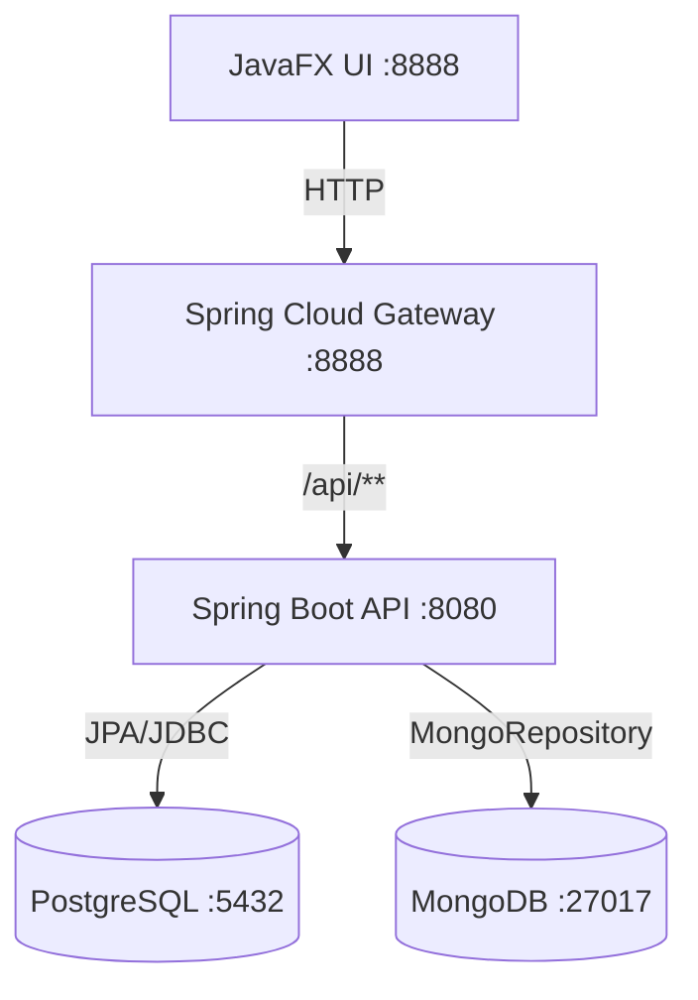

# Dijital Kitap Satış Otomasyonu

TBL324 - İleri Java Uygulamaları dersi projesi.

---

## Mimari



---

## Teknolojiler

| Katman | Teknoloji |
|--------|-----------|
| Backend | Spring Boot 4.0, Java 21 |
| İlişkisel DB | PostgreSQL 16 (TimescaleDB) |
| NoSQL DB | MongoDB (Docker) |
| UI | JavaFX |
| Gateway | Spring Cloud Gateway |
| Container | Docker / docker-compose |

---

## Kurulum

### Gereksinimler
- Java 21+
- Docker Desktop
- Maven

### 1. Docker ile tüm sistemi başlat
```bash
docker-compose up
```

### 2. Sadece veritabanlarını başlat (geliştirme için)
```bash
# PostgreSQL
docker start timescaledb-pg16

# MongoDB
docker start mongodb
```

### 3. Backend başlat
```bash
cd book-service
.\mvnw.cmd spring-boot:run
```

### 4. Gateway başlat
```bash
cd gateway
.\mvnw.cmd spring-boot:run
```

### 5. UI başlat
```bash
cd ui
.\mvnw.cmd javafx:run
```

---

## API Endpoints

Tüm istekler Gateway üzerinden (`localhost:8888`) veya direkt API'den (`localhost:8080`) yapılabilir.

### Kitaplar
| Method | URL | Açıklama |
|--------|-----|----------|
| GET | `/api/books` | Tüm kitaplar |
| GET | `/api/books/{id}` | ID ile kitap |
| POST | `/api/books` | Kitap ekle |
| PUT | `/api/books/{id}` | Kitap güncelle |
| DELETE | `/api/books/{id}` | Kitap sil |

### Kullanıcılar
| Method | URL | Açıklama |
|--------|-----|----------|
| GET | `/api/users` | Tüm kullanıcılar |
| POST | `/api/users` | Kullanıcı ekle |
| PUT | `/api/users/{id}` | Kullanıcı güncelle |
| DELETE | `/api/users/{id}` | Kullanıcı sil |

### Siparişler
| Method | URL | Açıklama |
|--------|-----|----------|
| GET | `/api/orders` | Tüm siparişler |
| GET | `/api/orders/user/{userId}` | Kullanıcı siparişleri |
| POST | `/api/orders/user/{userId}` | Sipariş oluştur |
| PATCH | `/api/orders/{id}/status` | Durum güncelle |

### Aktivite Logları (MongoDB)
| Method | URL | Açıklama |
|--------|-----|----------|
| GET | `/api/logs` | Tüm loglar |
| GET | `/api/logs/entity/Book` | Kitap logları |

---

## Performans Testleri

k6 kurulumu: [k6.io](https://k6.io/docs/get-started/installation/)

```bash
# Yük testi (kademeli artış)
k6 run k6/load_test.js

# Spike testi (ani yük)
k6 run k6/spike_test.js
```

---

## Proje Yapısı

```
digital_book_sales_automation/
├── book-service/       # Spring Boot REST API
│   ├── controller/     # HTTP endpoint'leri
│   ├── service/        # İş mantığı
│   ├── repository/     # DB erişimi (JPA + Mongo)
│   ├── model/          # Entity sınıfları
│   ├── dto/            # ApiResponse<T>
│   ├── exception/      # GlobalExceptionHandler
│   └── strategy/       # DiscountStrategy (Strategy Pattern)
├── gateway/            # Spring Cloud Gateway
├── ui/                 # JavaFX arayüzü
├── k6/                 # Performans testleri
├── docs/               # Proje dokümanları
└── docker-compose.yml  # Tüm sistem
```
