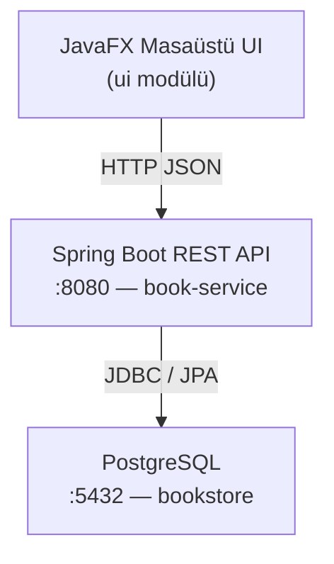

# Dijital Kitap Satış ve Otomasyon Sistemi

**Ders:** TBL324 — İleri Java Uygulamaları  
**Üniversite:** Kocaeli Üniversitesi, Teknoloji Fakültesi, Bilişim Sistemleri Mühendisliği  
**Ekip:** Metin Batin Dincer · uygardevrim41

---

## Giriş Bilgileri

| Rol | E-posta | Şifre |
|-----|---------|-------|
| **Admin** | `admin1@gmail.com` | `123456` |
| Müşteri | Kayıt ol ekranından oluşturun | — |
| Misafir | Giriş yapmadan devam et | — |

---

## Mimari



---

## Modüller

### book-service (Backend)
- **Spring Boot 4.0.3** · Java 21 · PostgreSQL
- `AuthController` — `POST /api/auth/login`
- `BookController` — `GET/POST/PUT/DELETE /api/books`
- `UserController` — `GET/POST/PUT/DELETE /api/users`
- `OrderController` — sipariş yönetimi
- `GlobalExceptionHandler` — 400 / 404 / 409 / 500 HTTP kodları
- `ApiResponse<T>` — generic yanıt sarmalayıcı

### ui (Frontend)
- **JavaFX 21** · Jackson
- **Login ekranı** — giriş / kayıt / misafir
- **Rol tabanlı panel** — admin yönetim + satış; müşteri/misafir sadece satış
- **Satış ekranı** — sepet, PaymentDialog (kart doğrulama), PDF makbuz indirme
- **Profil ekranı** — kart bilgisi kaydetme

---

## OOP / SOLID Yapısı

| Yapı | Nerede |
|------|--------|
| `interface Payable` | `SalesView` ödeme işlemini soyutlar |
| `interface Downloadable` | `SalesView` PDF indirmeyi soyutlar |
| `abstract BaseView` | `BookListView`, `SalesView`, `ProfileView` ortak tabanı |
| `SessionManager` (Singleton) | Aktif kullanıcı oturumu yönetimi |
| `ApiResponse<T>` (Generic) | Backend + UI'da tip güvenli yanıt sarmalayıcı |
| `CardValidator` | Luhn algoritması, son kullanma ve CVV doğrulama |
| `PdfReceiptGenerator` | Harici kütüphane olmadan saf Java ile PDF üretimi |

---

## Çalıştırma

```bash
# 1. Backend
cd book-service
./mvnw spring-boot:run

# 2. UI (yeni terminal)
cd ui
./mvnw javafx:run
```

**Gereksinimler:** Java 21, PostgreSQL 16 (`bookstore` veritabanı, `postgres` / `123456`)

---

## Puanlama Durumu

| Kriter | Puan | Durum |
|--------|------|-------|
| API & Back-end | 10 | ✅ |
| Generic Yapılar | 10 | ✅ `ApiResponse<T>` |
| Custom GUI | 10 | ✅ JavaFX |
| JDBC & NoSQL | 10 | ⏳ PostgreSQL ✅ · Redis/MongoDB 🔜 |
| SOLID & OOP | 10 | ✅ |
| Hata Yönetimi | 5 | ✅ GlobalExceptionHandler |
| Performans Testleri | 5 | 🔜 |
| Analiz & Doküman | 5 | ✅ Bu dosya |
| TDD | +10 | 🔜 |
| Dockerize | +5 | 🔜 |
